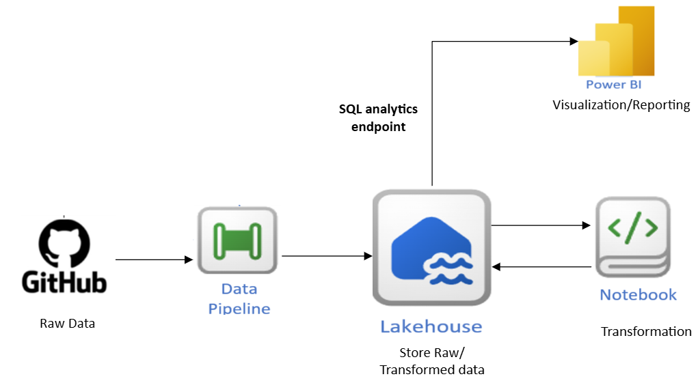

# Olympic_Fabric_data_engineering_project

## Overview
This project focuses on building a comprehensive data engineering pipeline for the Tokyo Olympic Games, leveraging Fabric services such as Lakehouse, Data pipelines, notebooks. The pipeline aims to handle data integration, transformation, and analysis to support valuable insights for the Olympic events.

##Architecture

## Technologies Used
- Fabric Lakehouse - Store big data for cleaning, querying, sharing, and reporting
- Fabric Data Pipelines - Ingest data at scale and schedule workflows
- Fabric Notebooks - Explore, analyse and transform using PySpark and T-SQL.
- Power BI - Created Data visualizations and reports.
